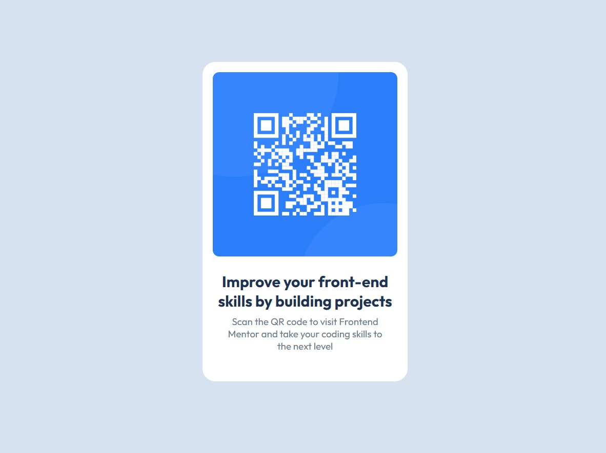

# Frontend Mentor - QR code component solution

This is a solution to the [QR code component challenge on Frontend Mentor](https://www.frontendmentor.io/challenges/qr-code-component-iux_sIO_H). Frontend Mentor challenges help you improve your coding skills by building realistic projects.

## Table of contents

- [Overview](#overview)
  - [Screenshot](#screenshot)
- [My process](#my-process)
  - [Built with](#built-with)
  - [What I learned](#what-i-learned)
  - [Continued development](#continued-development)
  - [Useful resources](#useful-resources)
- [Author](#author)
- [Acknowledgments](#acknowledgments)

## Overview

### Screenshot

## My process

## 🛠️ How I Built It

I structured the layout using semantic HTML and styled it with CSS. Flexbox was used to center the content, and border-radius was applied to create smooth, rounded corners on both the card and the image. The QR code image was wrapped inside a `<figure>` tag to semantically group it and control its padding and spacing from the rest of the content.
To make the image fully fit its parent container, its display was set to `block`, replacing the default inline behavior. I also used the box model to control spacing through margin and padding.

### Built with

- Semantic HTML5 markup
- CSS3

### What I learned

1. How the **box model** works and how padding, borders, and margins affect layout
2. How to use **Flexbox** to center elements both vertically and horizontally
3. How to apply **border-radius** for creating smooth, rounded corners
4. How to fit an **image** in it's Parent Container 

## Author

- Frontend Mentor - [@Adil-Solkar](https://www.frontendmentor.io/profile/Adil-Solkar)
